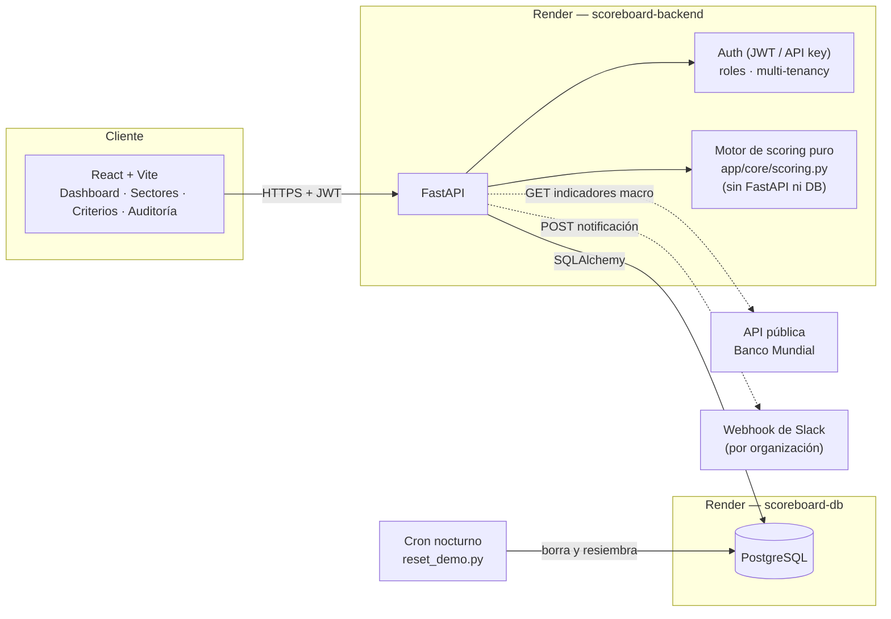

# Scoreboard de Oportunidad de Negocio

Sistema para sistematizar (en vez de hacer a mano en una hoja de cálculo) el análisis
de oportunidad de sectores/nichos de negocio en República Dominicana: registrar sectores,
calificarlos con criterios ponderados y configurables, compararlos en un dashboard, y
exportar un reporte en PDF de los mejores. Incluye multi-tenancy, roles, auditoría con
reversión, comentarios, notificaciones y una API pública con rate limiting — documentado
con honestidad sobre qué de eso es real y qué necesitaría credenciales externas para
producción (ver [más abajo](#features-corporativas-qué-es-real-y-qué-no)).

**Demo en vivo:** https://scoreboard-frontend.onrender.com *(instancia de solo lectura para
el público, se resetea cada noche — ver [Demo pública](#demo-pública))*

[](https://github.com/TU-USUARIO/scoreboard-oportunidad-negocio/actions/workflows/ci.yml)

| Rol | Email | Contraseña |
|---|---|---|
| viewer (solo lectura) | `viewer@acme-analytics.do` | `Viewer123!` |

## Capturas

<!-- Reemplazar estos archivos en docs/img/ -- ver docs/img/README.md para el detalle
     de qué mostrar en cada uno. Los nombres ya están enlazados, no hace falta tocar
     este README de nuevo. -->


| Dashboard | Detalle de sector |
|---|---|
|  |  |


## Arquitectura



El **motor de scoring** (`app/core/scoring.py`) es el único componente sin dependencias
de infraestructura a propósito: son dataclasses de Python puro, testeables sin levantar
DB ni servidor, y reutilizables desde un script o notebook si hiciera falta.

## Quickstart (local)

### 1. Base de datos

Pensado para **PostgreSQL** en producción; **SQLite** funciona igual de bien para
probar sin instalar nada (es lo que usan los tests y lo que trae `.env` por defecto).

```bash
cd backend
cp .env.example .env
```

### 2. Backend

```bash
cd backend
python -m venv .venv && .venv\Scripts\activate   # Windows
pip install -r requirements.txt

python -m alembic upgrade head   # migraciones reales, no create_all
python seed.py                    # organización + usuarios + 8 sectores dominicanos evaluados

python -m uvicorn app.main:app --reload --port 8000
```

Docs interactivos en `http://localhost:8000/docs`.

**Usuarios de prueba** (los imprime `seed.py` al correr):

| Rol | Email | Contraseña |
|---|---|---|
| admin | admin@acme-analytics.do | Admin123! |
| editor | editor@acme-analytics.do | Editor123! |
| viewer | viewer@acme-analytics.do | Viewer123! |

### 3. Frontend

```bash
cd frontend
npm install
cp .env.example .env     # VITE_API_URL=http://localhost:8000
npm run dev
```

### 4. Tests

```bash
cd backend
python -m pytest -q
```

43 tests: motor de scoring puro, flujo end-to-end de la API, features corporativas
(roles, multi-tenancy, auditoría+reversión, comentarios+mención→notificación, API keys),
los hallazgos de la revisión de seguridad, y el ciclo de reset de la demo pública —
cada comportamiento tiene su test para que no se repita un regresión.

## Despliegue

`render.yaml` en la raíz define los 4 recursos como [Blueprint de Render](https://render.com/docs/blueprint-spec):
Postgres, el backend (FastAPI), el frontend (sitio estático) y un cron job nocturno.
Conectar el repo en render.com → "New Blueprint Instance" crea los cuatro de una vez.

- `SECRET_KEY` se genera solo por Render (`generateValue: true`) — nunca vive en el repo.
- `DATABASE_URL` se conecta automáticamente desde el recurso de Postgres.
- El backend corre `alembic upgrade head` antes de arrancar uvicorn en cada deploy — nunca `create_all`.
- `CORS_ORIGINS` apunta a la URL del frontend (ambas son predecibles porque son los
  `name:` de los servicios en `render.yaml`; ver los comentarios ahí si les cambias el nombre).
- `TRUST_PROXY_HEADERS=true` en el backend: detrás del proxy de Render, `request.client.host`
  sería la IP interna del proxy para todo el tráfico — con esto, el rate limiter usa el
  último valor de `X-Forwarded-For` en su lugar (ver `app/core/rate_limit.py`). **Nunca
  activar esta variable si la app recibe tráfico directo sin un proxy de por medio.**

## Demo pública

La instancia en `scoreboard-frontend.onrender.com` es pública y de solo lectura vía la
cuenta `viewer@acme-analytics.do` (credenciales arriba). El rol `viewer` no puede crear,
editar ni borrar sectores, criterios o evaluaciones — está aplicado en el backend
(`require_role`), no solo escondido en el frontend, y hay un test que lo prueba
(`tests/test_reset_demo.py::test_viewer_demo_no_puede_crear_editar_ni_borrar_nada`). Sí
puede comentar (es una decisión de producto: "viewer" es solo lectura de los datos de
negocio, no de toda interacción) — esos comentarios, junto con cualquier otra cosa que
alguien pruebe crear con otra cuenta, desaparecen en el reset nocturno.

`backend/reset_demo.py` corre cada noche (cron job de Render, `0 6 * * *` = 2am hora RD)
y borra todos los datos + vuelve a sembrar la organización de ejemplo desde cero,
reutilizando la misma función de siembra que `seed.py` (`sembrar()` en `seed.py`). Tiene
su propio guardrail (`ES_INSTANCIA_DEMO=si`) para no poder correr por accidente contra
una base que no sea la de esta demo.

## Decisiones técnicas

Cinco decisiones que no son obvias a primera vista, y por qué:

**Score calculado al vuelo, nunca persistido.** No existe una tabla `scores_calculados`.
El score de una ronda de evaluación se recalcula en cada request a partir de los
criterios *activos* y sus pesos *actuales* (`app/services/scoring_service.py`). La
alternativa (guardar el score al momento de evaluar) es más rápida de leer, pero
significa que cambiar un peso deja el histórico desactualizado hasta que alguien vuelva
a guardar cada sector — con el cálculo al vuelo, ajustar un peso recalcula
retroactivamente *todo* el histórico de *todos* los sectores, gratis y sin migración.

**Invitaciones con token, no "escribir el nombre de la organización".** La primera
versión dejaba unirse a una organización existente con solo saber su nombre exacto (y
quedabas de viewer). Cualquiera que supiera el nombre de una empresa podía ver sus
sectores, notas y comentarios. Ahora unirse requiere un token real generado por un admin
de esa organización, atado a un email específico y con expiración (`POST /invitaciones`,
`app/api/routers/invitaciones.py`).

**Validación anti-SSRF del webhook de Slack.** El servidor le hace un `POST` a la URL del
webhook cada vez que hay una notificación. Sin validar esa URL, un admin (o alguien que
comprometiera esa cuenta) podía apuntarla a `http://127.0.0.1:...` o a la metadata de la
nube (`169.254.169.254`) y usar el propio servidor para atacar su red interna. Ahora solo
se acepta `https://hooks.slack.com/services/...` exacto — esquema, host y forma del path
(`app/schemas/organizacion.py::validar_webhook_slack`). De paso, la URL nunca sale
completa de la API (funciona como contraseña): se guarda enmascarada.

**Rondas validadas antes del commit, no después.** Registrar una evaluación construye la
ronda completa en memoria y corre el motor de scoring *sobre ese objeto en memoria*
antes de tocar la base. Si falta calificar un criterio activo, la petición falla con 422
y no se guarda nada. Antes se guardaba primero y se validaba después: una ronda
incompleta quedaba como "la última" del sector, que por lo tanto desaparecía del ranking
sin ningún aviso.

**Emails normalizados a minúsculas.** `Ana@empresa.com` y `ana@empresa.com` eran dos
cuentas distintas antes de esto — un login con otra capitalización simplemente fallaba,
y en teoría alguien podía registrar una cuenta con el mismo email en otra capitalización
para confundir a un admin invitando gente. Un `Annotated[EmailStr, AfterValidator(...)]`
(`app/schemas/auth.py::EmailNormalizado`) normaliza en el borde, una sola vez.

## Cómo funciona el motor de scoring

1. **Cada criterio tiene un peso.** No necesitan sumar 1.0 (100%): el motor los
   **normaliza automáticamente**. Agregar, desactivar o reponderar un criterio nunca
   rompe el cálculo.
2. **Cada calificación es un entero de 1 a 5**, y en todos los criterios **5 siempre es
   favorable a la oportunidad** (en "Nivel de saturación", 5 = baja saturación; en
   "Capital requerido", 5 = bajo capital). Todos los criterios suman en la misma dirección.
3. **Score final:** promedio ponderado, en escala 1-5 y 0-100 (esta última es la que se
   usa en el dashboard).
4. **Si falta calificar algún criterio activo, el cálculo falla explícitamente**
   (`ScoringError`) en vez de asumir un valor — ver "Rondas validadas antes del commit" arriba.

### Cómo ajustar los pesos

Sin tocar código: página **Criterios** del frontend, o `PATCH /criterios/{id}`. Cada
cambio de peso queda en el **audit log**, revertible con un clic por un admin/editor.

### El histórico

Cada evaluación crea una **ronda** (`rondas_evaluacion`) con su propia fecha — la
anterior no se sobrescribe. Los 8 sectores del seed traen 2-3 rondas cada uno en fechas
distintas, con notas que explican por qué cambió la calificación de una a la siguiente
(ver `backend/seed.py`), para que el gráfico de evolución en el detalle de un sector
tenga algo real que mostrar desde el primer arranque.

## Features corporativas: qué es real y qué no

Cada punto dice exactamente qué tan real es — esto es un proyecto de portafolio, no un
producto en producción, y prefiero decirlo explícito a dejar que parezca más de lo que es.

### Identidad y acceso

| Feature | Estado |
|---|---|
| Login con email+contraseña, JWT | **Real.** `bcrypt` + JWT (`python-jose`), 8h de expiración. |
| SSO/OAuth (Google, Microsoft) | **No implementado.** Requiere credenciales de una app registrada en ese proveedor. El modelo `User` ya tiene `oauth_provider`/`oauth_subject` listos para no migrar el esquema cuando se conecte (con `authlib`, por ejemplo). |
| Roles (admin/editor/viewer) | **Real**, aplicado en cada endpoint mutante (`app/api/deps.py::require_role`). |
| Multi-tenancy | **Real, a nivel de fila** (`organization_id` en cada tabla). Unirse a una organización existente requiere una invitación real (ver Decisiones técnicas). No es aislamiento a nivel de esquema/DB separado. |

### Auditoría y confiabilidad

| Feature | Estado |
|---|---|
| Audit log (quién cambió qué, cuándo) | **Real.** Un registro por campo modificado — `GET /auditoria`. |
| Reversión de cambios | **Real, acotada a propósito** (solo peso/estado activo de criterios), requiere admin/editor, y la reversión misma queda auditada. |
| Backups automáticos | **No hay un cron de backup** (sí hay uno de reset de demo, que es otra cosa). En Postgres real: `pg_dump`/`pg_restore` programado en tu infraestructura. El import/export CSV/Excel de sectores sirve como backup manual de los datos de negocio. |

### Colaboración

| Feature | Estado |
|---|---|
| Comentarios con @mención | **Real.** Detecta `@nombre` o `@email` de miembros de tu organización. |
| Notificaciones in-app | **Real**, siempre se crean. |
| Notificaciones por email | El código es real (`app/services/notificaciones.py`), **pero no sale nada sin credenciales SMTP** en `.env`. |
| Notificaciones a Slack | **Real, por organización** (no una env var global — ver Decisiones técnicas), inactivo sin que un admin configure su webhook. |
| Asignar sectores a responsables | **Real**, validado contra tu propia organización, dispara notificación real al cruzar el umbral de oportunidad. |

### Datos e integraciones

| Feature | Estado |
|---|---|
| Import/export CSV y Excel | **Real**, con pandas. Upsert por nombre, límite de 5MB, protegido contra inyección de fórmulas. |
| API pública con API keys | **Real.** `X-API-Key` como alternativa al JWT; se revoca al instante y deja de funcionar si el usuario se desactiva. |
| Rate limiting | **Real pero de demostración**: ventana deslizante en memoria de un solo proceso. No es correcto con varios workers — en un producto real iría en Redis. |
| Conectores a fuentes externas | **Uno real**: indicadores macro de RD desde la API pública del Banco Mundial, cacheado 24h. Fuentes de mercado dominicanas de pago (ONE, Nielsen, Kantar) requieren convenios que no existen en este entorno — el patrón para agregarlas es el mismo (`app/services/conectores/`). |

### Operación

| Feature | Estado |
|---|---|
| Migraciones con Alembic | **Real.** Única fuente de verdad del esquema, corre en cada deploy (ver Despliegue). |
| Logging estructurado | **Real.** JSON por línea, listo para un agregador real. |
| Health check | **Real.** `GET /health` prueba conectividad a la base (`SELECT 1`), no solo "el proceso responde". |
| Tests de carga | **Script real** con Locust (`backend/loadtest/locustfile.py`) — hay que instalarlo y lanzarlo a mano. |
| CI/CD | **Real** (`.github/workflows/ci.yml`): corre los 43 tests + build del frontend en cada push/PR. |

### UX a escala

| Feature | Estado |
|---|---|
| Paginación | **Real** en `GET /sectores` (`limit`/`offset` + `X-Total-Count`). |
| Filtros guardados | **Real**, aplicables con un clic desde el Dashboard. |
| Vistas personalizadas por usuario | **No implementado** — fuera del alcance de este proyecto de portafolio. |

## Modelo de datos

```
organizations       (id, nombre, slack_webhook_url?, creado_en)          — tenant
users                (id, organization_id, email, hashed_password, nombre_completo,
                      role[admin|editor|viewer], activo, oauth_provider?, oauth_subject?)
invitaciones         (id, organization_id, email, role, token, usada, expira_en)
sectores             (id, organization_id, creado_por_id, responsable_id,
                      nombre, descripcion, notas, fuentes_informacion, fecha_creacion)
criterios            (id, organization_id, nombre, peso, descripcion, activo, orden)
rondas_evaluacion    (id, sector_id, fecha, notas, creado_por_id, creado_en)
evaluaciones         (id, ronda_id, criterio_id, calificacion 1-5, notas)
audit_log            (id, organization_id, user_id, entidad, entidad_id, campo,
                      valor_anterior, valor_nuevo, revertido, creado_en)
comentarios          (id, sector_id, user_id, texto, menciones_user_ids[], creado_en)
notificaciones       (id, user_id, tipo, mensaje, entidad_ref, leido,
                      enviado_email, enviado_slack, creado_en)
api_keys             (id, user_id, nombre, prefijo, key_hash, revocada, creado_en, ultimo_uso_en)
filtros_guardados    (id, user_id, nombre, params, creado_en)
```

El score **no se persiste** (ver Decisiones técnicas): se calcula al vuelo a partir de
los criterios activos y las calificaciones de la ronda correspondiente.

## Endpoints principales

| Método | Ruta | Rol mínimo |
|---|---|---|
| POST | `/auth/registro`, `/auth/login` | público (10 intentos/min por IP) |
| GET | `/auth/me` | cualquiera autenticado |
| GET | `/usuarios` | cualquiera de tu org |
| PATCH | `/usuarios/{id}` | admin (no puede dejar la org sin ningún admin activo) |
| GET/POST/DELETE | `/invitaciones` | admin |
| GET/PATCH | `/organizacion` | cualquiera lee, admin edita (webhook de Slack) |
| GET/POST/PATCH/DELETE | `/sectores` | viewer lee, editor+ escribe |
| GET | `/sectores/exportar.csv`, `.xlsx` | cualquiera |
| POST | `/sectores/importar` | editor+ |
| GET/POST/PATCH | `/criterios` | viewer lee, editor+ escribe |
| DELETE | `/criterios/{id}` | admin |
| GET/POST/DELETE | `/sectores/{id}/rondas` | viewer lee, editor+ escribe |
| GET | `/dashboard/ranking`, `/sectores/{id}/radar`, `/sectores/{id}/historico` | cualquiera |
| GET | `/reportes/top-sectores.pdf` | cualquiera |
| GET | `/auditoria` | cualquiera de tu org |
| POST | `/auditoria/{id}/revertir` | editor+ |
| GET/POST/DELETE | `/sectores/{id}/comentarios` | cualquiera lee/comenta |
| GET/POST | `/notificaciones` | cualquiera (las suyas) |
| GET/POST/DELETE | `/api-keys` | cualquiera (las suyas) |
| GET/POST/DELETE | `/filtros-guardados` | cualquiera (los suyos) |
| GET | `/contexto-mercado/indicadores-macro` | cualquiera |
| GET | `/health` | público |

## Revisión de seguridad aplicada

Después de una revisión externa se corrigieron los siguientes hallazgos (cada uno con
un test en `backend/tests/` para que no se repita):

**Críticos**
- Cualquiera podía unirse a una organización ajena solo escribiendo su nombre exacto → invitaciones con token (ver Decisiones técnicas).
- Un viewer podía revertir cambios de auditoría → `POST /auditoria/{id}/revertir` exige admin/editor, y la reversión queda auditada.
- La app arrancaba con `SECRET_KEY` de ejemplo si no se configuraba una → ahora se niega a arrancar.
- Slack mandaba las notificaciones de todas las organizaciones a un único webhook global → ahora es por organización, con validación anti-SSRF.

**Altos**
- Una ronda de evaluación incompleta se guardaba antes de validar → se valida antes del `commit` (ver Decisiones técnicas).
- `/auth/login` y `/auth/registro` no tenían límite de intentos → 10/min por IP.
- El rate limiter por API key podía crecer sin límite con claves inválidas → valida formato antes de trackear, con tope de entradas.
- Las API keys de un usuario desactivado seguían funcionando → se chequea `user.activo`.
- Se podía asignar como responsable a alguien de otra organización → se valida que sea de la misma.
- El PDF fallaba (500) con nombres que tenían `<`, `&`, etc. → escapados con `xml.sax.saxutils.escape`.

**Conexión y rendimiento**
- Notificaciones en línea podían bloquear una petición ~30s con SMTP lento → se despachan en `BackgroundTask`.
- El conector del Banco Mundial no tenía caché → 24h de caché.
- Faltaban `pool_pre_ping`/`pool_recycle`/`pool_size` en Postgres → agregados.
- `create_all()` corría además de Alembic, pudiendo desincronizar el esquema → se quitó, Alembic es la única fuente de verdad.
- Los `DateTime` no tenían `timezone=True` → corregido en todas las tablas (con migración).
- `listar_sectores` volvía a consultar los criterios activos por sector (N+1) → se consulta una sola vez.

**Medios y menores**
- Importar sin límite de tamaño/nombre daba 500 con el detalle interno expuesto → límite de 5MB, validación, mensaje genérico.
- Importar un archivo con el mismo nombre de sector repetido dos veces creaba dos sectores duplicados → se trata como upsert también dentro del mismo archivo.
- Exportar un sector con nombre `=...`/`+...`/`-...`/`@...` era inyección de fórmulas en Excel → se antepone `'`.
- Un admin podía desactivarse a sí mismo dejando la organización sin ningún admin → bloqueado.
- Los schemas no limitaban el largo de los textos, el `orden` de un criterio, ni el tamaño de los `params` de un filtro guardado → `max_length`/rangos acordes a cada columna (evita también un 500 por overflow de `INTEGER` en Postgres).
- La invitación se marcaba como usada *antes* de crear la cuenta nueva; si crear el usuario fallaba después, el código quedaba quemado sin ninguna cuenta creada → todo en una sola transacción (`db.commit()` único, con `rollback` si falla).
- El webhook de Slack validado también contra variantes más sutiles de SSRF: subdominios falsos (`hooks.slack.com.evil.com`), `user:pass@` en la URL, puerto no estándar, esquema `http` — no solo el caso obvio.
- Bug en frontend: `AuthContext.login()` no esperaba a que el usuario cargara antes de navegar → corregido.
- `/health` no cerraba la sesión de DB si el `SELECT 1` fallaba → corregido con `try/finally`.
- `seed.py` se niega a correr contra una base que no parezca de desarrollo, salvo confirmación explícita.

**No se tocó (con criterio)**: el token de sesión en `localStorage` (aceptable para este
proyecto; la alternativa segura es una cookie httpOnly).

## Próximos pasos razonables (fuera de alcance aquí)

- SSO real (Google/Microsoft) una vez que exista una app registrada en ese proveedor.
- Rate limiting respaldado en Redis para correr con varios workers.
- Backups automatizados (cron + `pg_dump` a un bucket).
- Vistas de dashboard personalizables por usuario.
- Conectores a fuentes de mercado dominicanas de pago (ONE, Nielsen, Kantar) una vez que haya acceso.
